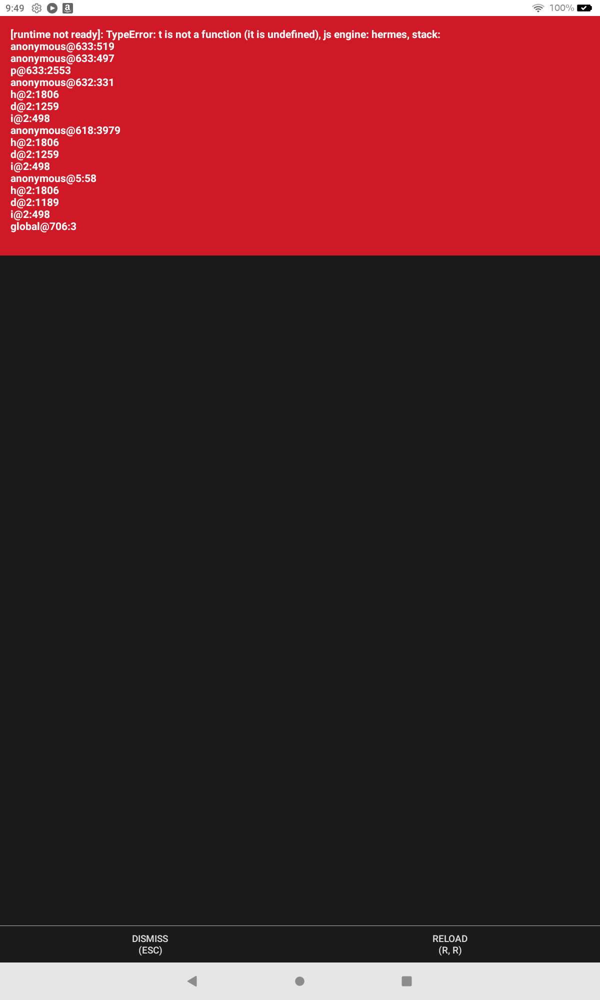

# Redux Thunk Demo for Amazon Fire Tablet

This is a React Native application that demonstrates the usage of [Redux Thunk](https://github.com/reduxjs/redux-thunk), a middleware for Redux that allows you to write action creators that return a function instead of an action.

## Features

This app showcases various Redux Thunk patterns with:

1. **Counter Example**
   - Basic synchronous actions
   - Asynchronous actions with setTimeout
   - Conditional actions (increment if odd)

2. **Todos Example**
   - Managing a list of items
   - Asynchronous todo creation
   - Toggle and delete operations

3. **Posts API Example**
   - Simulated API calls with mock data
   - Loading states and error handling
   - Fetching individual items by ID

4. **Users API Example**
   - Using getState() to check existing data
   - Multiple simulated API calls in a single thunk
   - Combining data from different sources

5. **Weather API Example**
   - Request cancellation with AbortController
   - Retry logic for failed requests
   - Simulated weather data

## Screenshot



## Implementation Details

The app demonstrates several key aspects of Redux Thunk:

- **Asynchronous Operations**: Handling simulated API calls and delayed actions
- **Conditional Logic**: Dispatching actions based on current state
- **Multiple Dispatches**: Dispatching multiple actions from a single thunk
- **Error Handling**: Proper error handling in async operations
- **Request Cancellation**: Cancelling in-flight requests
- **Retry Mechanisms**: Implementing retry logic for failed requests

## Offline Support

This version of the app uses mock data instead of real API calls to ensure it works properly on devices with limited or no internet connectivity, such as Amazon Fire tablets. All API calls are simulated with setTimeout and local data.

## Redux Thunk Examples

```javascript
// Basic thunk with async/await and mock data
export const fetchPosts = () => {
  return async (dispatch) => {
    dispatch({ type: FETCH_POSTS_REQUEST });
    
    try {
      // Simulate API delay
      await new Promise(resolve => setTimeout(resolve, 1000));
      
      // Use mock data instead of real API call
      dispatch({ 
        type: FETCH_POSTS_SUCCESS, 
        payload: MOCK_POSTS 
      });
      return MOCK_POSTS;
    } catch (error) {
      dispatch({ 
        type: FETCH_POSTS_FAILURE, 
        payload: error.message 
      });
      throw error;
    }
  };
};

// Thunk with getState
export const fetchUsers = () => {
  return async (dispatch, getState) => {
    // Check if we already have users and don't need to fetch again
    const { users } = getState();
    
    if (users.items.length > 0) {
      console.log('Users already loaded, skipping fetch');
      return;
    }
    
    dispatch({ type: FETCH_USERS_REQUEST });
    // ... rest of the implementation
  };
};
```

## Getting Started

1. Clone this repository:
   ```bash
   git clone https://github.com/mosesroth/redux-thunk-demo.git
   cd redux-thunk-demo
   ```

2. Install dependencies:
   ```bash
   npm install
   ```

3. Start the development server:
   ```bash
   npx expo start
   ```

4. To run on an Amazon Fire tablet:
   - Generate the bundle:
     ```bash
     npx react-native bundle --platform android --dev false --entry-file index.js --bundle-output android/app/src/main/assets/index.android.bundle --assets-dest android/app/src/main/res/
     ```
   - Build the APK:
     ```bash
     cd android && ./gradlew assembleDebug
     ```
   - Install on connected device:
     ```bash
     adb install -r app/build/outputs/apk/debug/app-debug.apk
     ```

## License

MIT
